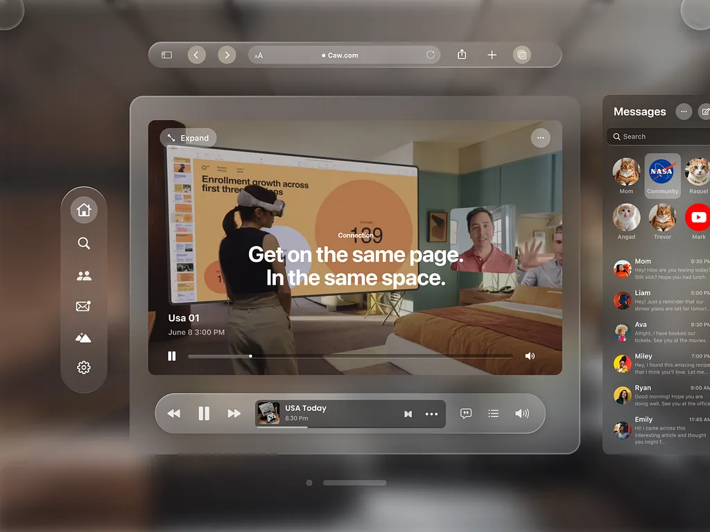

# Liquid Glass - Sistema de Diseño

> *"El efecto de cristal líquido que Apple popularizó en iOS 7 y que ahora domina el diseño moderno."*

## Referencia Visual



---

## Qué es Liquid Glass

**Liquid Glass** es la evolución del glassmorphism. Mientras glassmorphism simula vidrio estático, Liquid Glass añade **fluidez y movimiento** como si el cristal tuviera agua adentro.

### Glassmorphism (Base)

Glassmorphism es un estilo de diseño UI que simula **paneles de vidrio esmerilado flotante**. Se caracteriza por:

- **Transparencia**: Fondos semi-transparentes que dejan ver lo que hay detrás
- **Desenfoque**: Blur del contenido posterior (backdrop-blur)
- **Bordes sutiles**: Líneas claras que definen los límites del "vidrio"
- **Sombras suaves**: Profundidad que hace flotar el elemento
- **Luminosidad**: Efecto de luz que atraviesa el cristal

### Liquid Glass: La Evolución

El **Liquid Glass** añade fluidez al glassmorphism tradicional:
- Distorsiones tipo "agua ondulante"
- Animaciones dinámicas
- Cambios de color graduales
- Efecto de refracción líquida

---

## Ingredientes CSS Core

### 1. Backdrop Blur (El Más Importante)

```css
/* CSS Vanilla */
backdrop-filter: blur(16px);
-webkit-backdrop-filter: blur(16px); /* Safari */
```

```html
<!-- Tailwind -->
<div class="backdrop-blur-sm">   <!-- 4px -->
<div class="backdrop-blur">      <!-- 8px -->
<div class="backdrop-blur-md">   <!-- 12px -->
<div class="backdrop-blur-lg">   <!-- 16px -->
<div class="backdrop-blur-xl">   <!-- 24px -->
<div class="backdrop-blur-2xl">  <!-- 40px -->
<div class="backdrop-blur-3xl">  <!-- 64px -->

<!-- Valor personalizado -->
<div class="backdrop-blur-[20px]">
```

### 2. Fondo Semi-Transparente

```css
/* CSS Vanilla */
background: rgba(255, 255, 255, 0.1);
background: rgba(255, 255, 255, 0.15);
background: rgba(255, 255, 255, 0.2);
```

```html
<!-- Tailwind con opacidad -->
<div class="bg-white/5">   <!-- 5% opacidad -->
<div class="bg-white/10">  <!-- 10% opacidad - común -->
<div class="bg-white/15">  <!-- 15% opacidad -->
<div class="bg-white/20">  <!-- 20% opacidad - común -->
<div class="bg-white/25">  <!-- 25% opacidad -->

<!-- Fondos oscuros -->
<div class="bg-black/10">
<div class="bg-black/20">
<div class="bg-gray-900/30">

<!-- Con colores -->
<div class="bg-blue-500/10">
<div class="bg-purple-500/15">
```

### 3. Bordes de Vidrio

```css
/* CSS Vanilla */
border: 1px solid rgba(255, 255, 255, 0.2);
border: 1px solid rgba(255, 255, 255, 0.3);
```

```html
<!-- Tailwind -->
<div class="border border-white/10">
<div class="border border-white/20">  <!-- Común -->
<div class="border border-white/30">

<!-- Solo borde superior (efecto luz) -->
<div class="border-t border-white/30">

<!-- Borde interior con ring -->
<div class="ring-1 ring-white/10 ring-inset">
```

### 4. Sombras

```css
/* CSS Vanilla */
box-shadow: 0 8px 32px rgba(0, 0, 0, 0.1);
box-shadow: 0 25px 50px -12px rgba(0, 0, 0, 0.25);
```

```html
<!-- Tailwind -->
<div class="shadow-lg">
<div class="shadow-xl">
<div class="shadow-2xl">

<!-- Sombra con color -->
<div class="shadow-lg shadow-black/10">
<div class="shadow-xl shadow-purple-500/20">
```

### 5. Bordes Redondeados

```html
<div class="rounded-lg">     <!-- 8px -->
<div class="rounded-xl">     <!-- 12px -->
<div class="rounded-2xl">    <!-- 16px -->
<div class="rounded-3xl">    <!-- 24px -->
<div class="rounded-[20px]"> <!-- Personalizado -->
```

---

## Recetas Listas para Usar

### Card Glassmorphism Básica

```html
<div class="
  bg-white/10
  backdrop-blur-lg
  border border-white/20
  rounded-2xl
  shadow-xl
  p-6
">
  <h3 class="text-white font-semibold">Título</h3>
  <p class="text-white/70">Contenido de la card</p>
</div>
```

### Card Glassmorphism Premium

```html
<div class="
  relative
  bg-gradient-to-br from-white/20 to-white/5
  backdrop-blur-xl
  border border-white/20
  rounded-3xl
  shadow-2xl
  p-8
  overflow-hidden
">
  <!-- Highlight superior -->
  <div class="absolute inset-x-0 top-0 h-px bg-gradient-to-r from-transparent via-white/50 to-transparent"></div>

  <!-- Contenido -->
  <h3 class="text-white font-bold text-xl">Premium Card</h3>
  <p class="text-white/60 mt-2">Con gradiente y highlight</p>
</div>
```

### Botón Glassmorphism

```html
<button class="
  bg-white/10
  hover:bg-white/20
  backdrop-blur-md
  border border-white/20
  rounded-xl
  px-6 py-3
  text-white font-medium
  shadow-lg
  transition-all duration-300
  hover:shadow-xl
  hover:scale-105
">
  Click me
</button>
```

### Botón Glassmorphism con Glow

```html
<button class="
  relative
  bg-gradient-to-r from-purple-500/20 to-pink-500/20
  hover:from-purple-500/30 hover:to-pink-500/30
  backdrop-blur-xl
  border border-white/20
  rounded-2xl
  px-8 py-4
  text-white font-semibold
  shadow-xl shadow-purple-500/20
  hover:shadow-2xl hover:shadow-purple-500/30
  transition-all duration-300
  group
">
  <!-- Glow effect -->
  <span class="absolute inset-0 rounded-2xl bg-gradient-to-r from-purple-500 to-pink-500 opacity-0 group-hover:opacity-20 transition-opacity blur-xl"></span>
  <span class="relative">Get Started</span>
</button>
```

### Input Glassmorphism

```html
<input
  type="text"
  placeholder="Email address"
  class="
    w-full
    bg-white/5
    hover:bg-white/10
    focus:bg-white/10
    backdrop-blur-md
    border border-white/10
    focus:border-white/30
    rounded-xl
    px-4 py-3
    text-white
    placeholder-white/40
    outline-none
    transition-all duration-300
  "
/>
```

### Modal Glassmorphism

```html
<!-- Backdrop -->
<div class="fixed inset-0 bg-black/50 backdrop-blur-sm">

  <!-- Modal -->
  <div class="
    fixed top-1/2 left-1/2 -translate-x-1/2 -translate-y-1/2
    w-full max-w-md
    bg-white/10
    backdrop-blur-2xl
    border border-white/20
    rounded-3xl
    shadow-2xl
    p-8
  ">
    <h2 class="text-white text-2xl font-bold">Modal Title</h2>
    <p class="text-white/60 mt-4">Modal content goes here...</p>

    <div class="flex gap-4 mt-8">
      <button class="flex-1 bg-white/10 hover:bg-white/20 backdrop-blur-md border border-white/20 rounded-xl py-3 text-white transition-all">
        Cancel
      </button>
      <button class="flex-1 bg-white hover:bg-white/90 rounded-xl py-3 text-black font-semibold transition-all">
        Confirm
      </button>
    </div>
  </div>
</div>
```

### Navbar Glassmorphism

```html
<nav class="
  fixed top-0 inset-x-0
  bg-black/20
  backdrop-blur-xl
  border-b border-white/10
  z-50
">
  <div class="max-w-7xl mx-auto px-6 py-4 flex items-center justify-between">
    <span class="text-white font-bold text-xl">Logo</span>

    <div class="flex items-center gap-8">
      <a href="#" class="text-white/70 hover:text-white transition-colors">Home</a>
      <a href="#" class="text-white/70 hover:text-white transition-colors">Features</a>
      <a href="#" class="text-white/70 hover:text-white transition-colors">Pricing</a>

      <button class="bg-white/10 hover:bg-white/20 backdrop-blur-md border border-white/20 rounded-xl px-5 py-2 text-white transition-all">
        Sign In
      </button>
    </div>
  </div>
</nav>
```

### Sidebar Glassmorphism

```html
<aside class="
  fixed left-0 top-0 bottom-0
  w-64
  bg-black/30
  backdrop-blur-2xl
  border-r border-white/10
">
  <div class="p-6">
    <h2 class="text-white font-bold text-lg">Dashboard</h2>
  </div>

  <nav class="px-4 space-y-2">
    <a href="#" class="flex items-center gap-3 px-4 py-3 text-white bg-white/10 rounded-xl">
      <span>Overview</span>
    </a>
    <a href="#" class="flex items-center gap-3 px-4 py-3 text-white/60 hover:text-white hover:bg-white/5 rounded-xl transition-all">
      <span>Analytics</span>
    </a>
    <a href="#" class="flex items-center gap-3 px-4 py-3 text-white/60 hover:text-white hover:bg-white/5 rounded-xl transition-all">
      <span>Settings</span>
    </a>
  </nav>
</aside>
```

---

## Liquid Glass: Efectos Avanzados

### Animación de Fondo Flotante

```html
<!-- tailwind.config.ts -->
<!-- Añadir a theme.extend.animation y keyframes -->
```

```typescript
// tailwind.config.ts
export default {
  theme: {
    extend: {
      animation: {
        'float-bg': 'floatBG 15s ease-in-out infinite',
        'pulse-slow': 'pulse 4s cubic-bezier(0.4, 0, 0.6, 1) infinite',
      },
      keyframes: {
        floatBG: {
          '0%, 100%': { backgroundPosition: 'center center' },
          '50%': { backgroundPosition: '70% 30%' },
        },
      },
    },
  },
}
```

```html
<!-- Uso -->
<div class="animate-float-bg bg-[length:200%_200%] bg-gradient-to-br from-purple-500/30 via-pink-500/20 to-blue-500/30 backdrop-blur-xl">
  Contenido con fondo animado
</div>
```

### Efecto de Distorsión con SVG Filter

```html
<svg class="absolute w-0 h-0">
  <defs>
    <filter id="liquid-glass">
      <feTurbulence
        type="fractalNoise"
        baseFrequency="0.02"
        numOctaves="3"
        result="noise"
      />
      <feDisplacementMap
        in="SourceGraphic"
        in2="noise"
        scale="20"
        xChannelSelector="R"
        yChannelSelector="G"
      />
    </filter>
  </defs>
</svg>

<div class="[filter:url(#liquid-glass)] bg-white/10 backdrop-blur-lg">
  Contenido con distorsión líquida
</div>
```

### Efecto Aurora/Northern Lights

```html
<div class="relative overflow-hidden rounded-3xl">
  <!-- Aurora background -->
  <div class="absolute inset-0 bg-gradient-to-r from-purple-500/30 via-pink-500/20 to-cyan-500/30 animate-pulse-slow blur-3xl"></div>
  <div class="absolute inset-0 bg-gradient-to-l from-blue-500/20 via-teal-500/20 to-purple-500/20 animate-pulse-slow blur-3xl" style="animation-delay: 2s;"></div>

  <!-- Glass panel -->
  <div class="relative bg-black/20 backdrop-blur-xl border border-white/10 p-8">
    <h2 class="text-white font-bold">Aurora Effect</h2>
  </div>
</div>
```

### Efecto Holográfico

```html
<div class="
  relative
  bg-gradient-to-br from-purple-500/10 via-transparent to-cyan-500/10
  backdrop-blur-xl
  border border-white/20
  rounded-2xl
  p-6
  overflow-hidden
  before:absolute before:inset-0
  before:bg-gradient-to-r before:from-transparent before:via-white/10 before:to-transparent
  before:translate-x-[-100%]
  hover:before:translate-x-[100%]
  before:transition-transform before:duration-1000
">
  <h3 class="text-white relative z-10">Holographic Card</h3>
</div>
```

---

## Fondos Recomendados

El glassmorphism **REQUIERE** un fondo con contenido visible para que el blur tenga efecto.

### Gradientes Abstractos

```html
<!-- Fondo con gradientes -->
<div class="min-h-screen bg-gradient-to-br from-purple-900 via-slate-900 to-black">
  <!-- Elementos decorativos -->
  <div class="fixed top-20 left-20 w-72 h-72 bg-purple-500 rounded-full blur-[128px] opacity-30"></div>
  <div class="fixed top-40 right-40 w-96 h-96 bg-pink-500 rounded-full blur-[128px] opacity-20"></div>
  <div class="fixed bottom-20 left-1/2 w-80 h-80 bg-blue-500 rounded-full blur-[128px] opacity-25"></div>

  <!-- Tu contenido glassmorphism aquí -->
</div>
```

### Con Imagen de Fondo

```html
<div class="min-h-screen bg-cover bg-center" style="background-image: url('/bg.jpg')">
  <div class="min-h-screen bg-black/40 backdrop-blur-sm">
    <!-- Tu contenido glassmorphism aquí -->
  </div>
</div>
```

### Mesh Gradient

```html
<div class="
  min-h-screen
  bg-slate-950
  [background-image:radial-gradient(at_40%_20%,rgba(120,119,198,0.3)_0px,transparent_50%),radial-gradient(at_80%_0%,rgba(251,113,133,0.3)_0px,transparent_50%),radial-gradient(at_0%_50%,rgba(59,130,246,0.3)_0px,transparent_50%),radial-gradient(at_80%_50%,rgba(168,85,247,0.3)_0px,transparent_50%),radial-gradient(at_0%_100%,rgba(20,184,166,0.3)_0px,transparent_50%)]
">
  <!-- Tu contenido glassmorphism aquí -->
</div>
```

---

## Mejores Prácticas

### DO (Hacer)

1. **Siempre tener un fondo visible** - Sin contenido detrás, el blur no tiene efecto
2. **Usar opacidades bajas** - Entre 5% y 25% para el fondo del vidrio
3. **Combinar backdrop-blur con bg transparente** - Ambos son necesarios
4. **Añadir bordes sutiles** - Definen los límites del panel de vidrio
5. **Incluir sombras** - Crean la ilusión de profundidad y flotación
6. **Usar transiciones suaves** - `transition-all duration-300` en hovers
7. **Considerar el contraste de texto** - Usar `text-white` o `text-white/70`
8. **Probar en Safari** - Requiere `-webkit-backdrop-filter`

### DON'T (No Hacer)

1. **No usar sobre fondos sólidos** - El blur no tendrá efecto visible
2. **No excederse con la opacidad** - Más de 30% se ve "cloudy"
3. **No olvidar el fallback** - Navegadores viejos no soportan backdrop-filter
4. **No apilar muchos elementos glass** - Puede afectar el rendimiento
5. **No ignorar la accesibilidad** - El texto debe ser legible
6. **No usar blur muy alto en áreas grandes** - Afecta el rendimiento

### Fallback para Navegadores Sin Soporte

```html
<div class="
  bg-slate-800/90
  supports-[backdrop-filter]:bg-white/10
  supports-[backdrop-filter]:backdrop-blur-lg
  border border-white/20
  rounded-2xl
  p-6
">
  Contenido con fallback
</div>
```

---

## Paletas de Color Recomendadas

### Dark Mode (Más Común)

```html
<!-- Fondos -->
bg-white/5, bg-white/10, bg-white/15, bg-white/20

<!-- Bordes -->
border-white/10, border-white/20, border-white/30

<!-- Texto -->
text-white, text-white/90, text-white/70, text-white/50
```

### Light Mode (Menos Común)

```html
<!-- Fondos -->
bg-black/5, bg-black/10, bg-gray-900/10

<!-- Bordes -->
border-black/10, border-gray-500/20

<!-- Texto -->
text-gray-900, text-gray-700, text-gray-500
```

### Con Acentos de Color

```html
<!-- Purple -->
bg-purple-500/10, border-purple-400/30, shadow-purple-500/20

<!-- Blue -->
bg-blue-500/10, border-blue-400/30, shadow-blue-500/20

<!-- Pink/Rose -->
bg-pink-500/10, border-pink-400/30, shadow-pink-500/20

<!-- Cyan -->
bg-cyan-500/10, border-cyan-400/30, shadow-cyan-500/20
```

---

## Componentes shadcn/ui con Glassmorphism

### Sobrescribir estilos base

```typescript
// src/shared/lib/utils.ts - extender cn()

// Preset de clases glassmorphism
export const glass = {
  base: 'bg-white/10 backdrop-blur-lg border border-white/20 rounded-2xl',
  card: 'bg-white/10 backdrop-blur-xl border border-white/20 rounded-3xl shadow-xl',
  button: 'bg-white/10 hover:bg-white/20 backdrop-blur-md border border-white/20 rounded-xl transition-all',
  input: 'bg-white/5 backdrop-blur-md border border-white/10 focus:border-white/30 rounded-xl',
  modal: 'bg-white/10 backdrop-blur-2xl border border-white/20 rounded-3xl shadow-2xl',
}
```

---

## Performance Tips

1. **Limitar elementos con backdrop-blur** - Cada uno requiere renderizado extra
2. **Usar will-change con cuidado** - `will-change: backdrop-filter` puede ayudar
3. **Reducir blur en móviles** - Usar `backdrop-blur-md` en lugar de `backdrop-blur-2xl`
4. **Evitar animaciones en elementos con blur** - O usar `transform` en lugar de propiedades costosas

```html
<!-- Responsive blur -->
<div class="backdrop-blur-md lg:backdrop-blur-xl">
  Menos blur en móvil, más en desktop
</div>
```

---

## Referencias

- [Apple Human Interface Guidelines - Materials](https://developer.apple.com/design/human-interface-guidelines/materials)
- [Tailwind CSS - Backdrop Blur](https://tailwindcss.com/docs/backdrop-blur)
- [MDN - backdrop-filter](https://developer.mozilla.org/en-US/docs/Web/CSS/backdrop-filter)
- [Can I Use - backdrop-filter](https://caniuse.com/css-backdrop-filter)

---

*Este documento es parte del Design System de SaaS Factory V2.*
