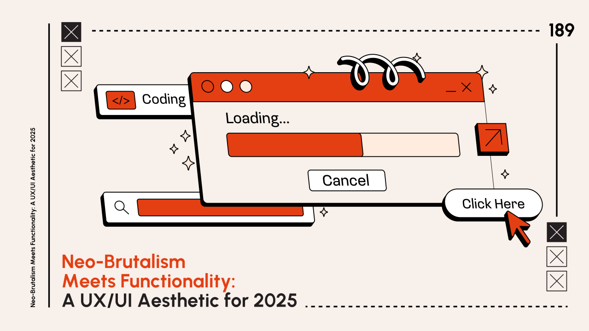
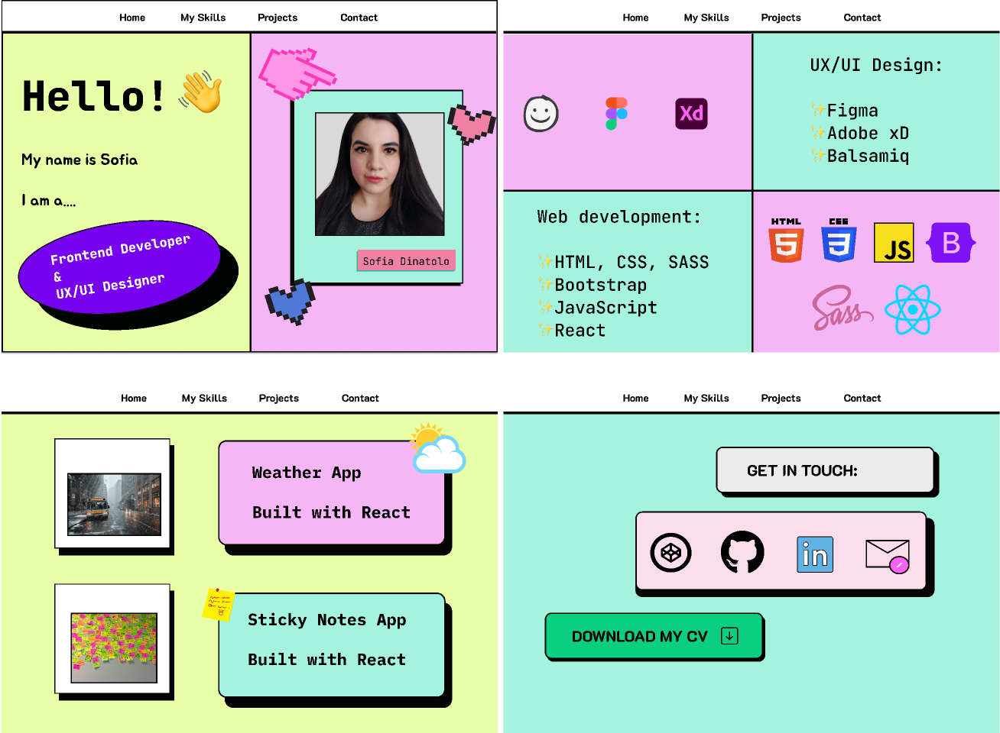

# Neobrutalism - Sistema de Diseño

> *"Diseño crudo, honesto y sin disculpas. Bordes duros, sombras sólidas, colores que gritan."*

## Referencia Visual




---

## Qué es Neobrutalism

**Neobrutalism** (Neo-Brutalism o Neubrutalism) es un estilo de diseño que combina:
- La **crudeza del Brutalism** arquitectónico
- La **funcionalidad del Minimalismo**
- Elementos **retro/nostálgicos** (Windows 98, early web)

### Filosofía

> "No gradientes. No brillo. Todo es plano y honesto. La estructura es visible."

Es una reacción contra el diseño "perfecto" y pulido. Abraza lo crudo, lo directo, lo imperfecto.

### Características Clave

| Característica | Descripción |
|----------------|-------------|
| Bordes gruesos | `border-2` o más, siempre negro |
| Sombras duras | Sin blur, offset sólido en X e Y |
| Colores vibrantes | Primarios saturados, alto contraste |
| Sin gradientes | Colores planos, sin transiciones |
| Tipografía bold | Sans-serif pesada, impactante |
| Formas geométricas | Rectángulos, ángulos duros |
| Estética retro | Reminiscente de interfaces antiguas |

---

## Los 5 Pilares del Neobrutalism

### 1. Hard Shadows (Sombras Duras)

La firma del neobrutalism. Sombras sólidas sin blur:

```css
/* CSS Vanilla */
box-shadow: 4px 4px 0px 0px #000000;

/* Con offset mayor */
box-shadow: 6px 6px 0px 0px #000000;
box-shadow: 8px 8px 0px 0px #000000;
```

```html
<!-- Tailwind con arbitrary values -->
<div class="shadow-[4px_4px_0px_0px_#000000]">
<div class="shadow-[6px_6px_0px_0px_#000000]">
<div class="shadow-[8px_8px_0px_0px_#000000]">

<!-- Simplificado -->
<div class="shadow-[4px_4px_0_#000]">
<div class="shadow-[6px_6px_0_#000]">
```

### 2. Thick Borders (Bordes Gruesos)

Bordes visibles, generalmente negros:

```html
<!-- Tailwind -->
<div class="border-2 border-black">    <!-- 2px -->
<div class="border-[3px] border-black"> <!-- 3px -->
<div class="border-4 border-black">    <!-- 4px - común -->
```

**Variante: Bordes asimétricos** (efecto 3D):

```html
<!-- Borde más grueso abajo y derecha -->
<div class="border-2 border-b-4 border-r-4 border-black">
```

### 3. Bold Colors (Colores Vibrantes)

Paleta de alto contraste, colores primarios saturados:

```html
<!-- Fondos típicos -->
<div class="bg-yellow-300">   <!-- Amarillo vibrante -->
<div class="bg-pink-400">     <!-- Rosa intenso -->
<div class="bg-cyan-300">     <!-- Cyan eléctrico -->
<div class="bg-lime-400">     <!-- Verde lima -->
<div class="bg-orange-400">   <!-- Naranja -->
<div class="bg-violet-400">   <!-- Violeta -->

<!-- Fondo base común -->
<body class="bg-[#e0e5ec]">   <!-- Gris azulado claro -->
<body class="bg-amber-50">    <!-- Crema cálido -->
<body class="bg-white">       <!-- Blanco puro -->
```

### 4. No Gradients (Sin Gradientes)

Todo plano. Los colores no se mezclan:

```html
<!-- ✅ CORRECTO -->
<div class="bg-yellow-300">Fondo sólido</div>

<!-- ❌ INCORRECTO para Neobrutalism -->
<div class="bg-gradient-to-r from-yellow-300 to-orange-400">No usar</div>
```

### 5. Bold Typography (Tipografía Impactante)

Fuentes pesadas, sans-serif, que demandan atención:

```html
<!-- Tailwind -->
<h1 class="font-black text-5xl">BOLD STATEMENT</h1>
<h2 class="font-extrabold text-4xl uppercase">SUBTITLE</h2>
<p class="font-medium text-lg">Body text más neutral</p>

<!-- Google Fonts recomendadas -->
<!-- Space Grotesk, Inter, Work Sans, Archivo Black, Bebas Neue -->
```

---

## Implementación con Tailwind CSS

### Configuración Recomendada

```typescript
// tailwind.config.ts
export default {
  theme: {
    extend: {
      boxShadow: {
        'brutal-sm': '2px 2px 0px 0px #000000',
        'brutal': '4px 4px 0px 0px #000000',
        'brutal-md': '6px 6px 0px 0px #000000',
        'brutal-lg': '8px 8px 0px 0px #000000',
        'brutal-xl': '12px 12px 0px 0px #000000',
      },
      fontFamily: {
        'brutal': ['Space Grotesk', 'sans-serif'],
      },
      colors: {
        'brutal': {
          yellow: '#FFE500',
          pink: '#FF6B9C',
          cyan: '#00D4FF',
          lime: '#C4F000',
          orange: '#FF8A00',
          violet: '#8B5CF6',
          black: '#000000',
          white: '#FFFFFF',
        }
      }
    },
  },
}
```

---

## Recetas Listas para Usar

### Botón Neobrutalism Básico

```html
<button class="
  bg-yellow-300
  border-2 border-black
  shadow-[4px_4px_0px_0px_#000000]
  px-6 py-3
  font-bold
  hover:translate-x-[2px] hover:translate-y-[2px]
  hover:shadow-[2px_2px_0px_0px_#000000]
  active:translate-x-[4px] active:translate-y-[4px]
  active:shadow-none
  transition-all duration-100
">
  Click Me
</button>
```

### Botón con Bordes Asimétricos

```html
<button class="
  bg-white
  border-2 border-b-4 border-r-4 border-black
  rounded-lg
  px-6 py-3
  font-bold
  hover:border-b-2 hover:border-r-2
  hover:translate-x-[2px] hover:translate-y-[2px]
  transition-all duration-150
">
  Asymmetric Button
</button>
```

### Botón Colorido

```html
<button class="
  bg-pink-400
  text-black
  border-4 border-black
  shadow-[6px_6px_0px_0px_#000000]
  px-8 py-4
  font-black text-lg uppercase
  hover:translate-x-[3px] hover:translate-y-[3px]
  hover:shadow-[3px_3px_0px_0px_#000000]
  transition-all duration-100
">
  BRUTAL BUTTON
</button>
```

### Card Neobrutalism

```html
<div class="
  bg-white
  border-4 border-black
  shadow-[8px_8px_0px_0px_#000000]
  p-6
">
  <h3 class="font-black text-2xl mb-2">Card Title</h3>
  <p class="text-gray-700">Card content goes here. Keep it bold and direct.</p>

  <button class="
    mt-4
    bg-cyan-300
    border-2 border-black
    shadow-[4px_4px_0px_0px_#000000]
    px-4 py-2
    font-bold
    hover:translate-x-[2px] hover:translate-y-[2px]
    hover:shadow-[2px_2px_0px_0px_#000000]
    transition-all duration-100
  ">
    Action
  </button>
</div>
```

### Card con Header Colorido

```html
<div class="
  bg-white
  border-4 border-black
  shadow-[8px_8px_0px_0px_#000000]
  overflow-hidden
">
  <!-- Header colorido -->
  <div class="bg-lime-400 border-b-4 border-black px-6 py-4">
    <h3 class="font-black text-xl">FEATURED</h3>
  </div>

  <!-- Content -->
  <div class="p-6">
    <p class="text-gray-800 mb-4">Content with a colored header section.</p>
    <span class="
      inline-block
      bg-black text-white
      px-3 py-1
      font-bold text-sm
    ">
      TAG
    </span>
  </div>
</div>
```

### Input Neobrutalism

```html
<input
  type="text"
  placeholder="Enter your email"
  class="
    w-full
    bg-white
    border-4 border-black
    shadow-[4px_4px_0px_0px_#000000]
    px-4 py-3
    font-medium
    placeholder-gray-500
    focus:outline-none
    focus:shadow-[2px_2px_0px_0px_#000000]
    focus:translate-x-[2px] focus:translate-y-[2px]
    transition-all duration-100
  "
/>
```

### Input con Label

```html
<div class="space-y-2">
  <label class="font-bold text-lg">Email Address</label>
  <input
    type="email"
    placeholder="you@example.com"
    class="
      w-full
      bg-amber-50
      border-4 border-black
      shadow-[4px_4px_0px_0px_#000000]
      px-4 py-3
      font-medium
      focus:outline-none
      focus:bg-white
      transition-colors
    "
  />
</div>
```

### Checkbox Neobrutalism

```html
<label class="flex items-center gap-3 cursor-pointer">
  <div class="
    w-6 h-6
    bg-white
    border-4 border-black
    shadow-[2px_2px_0px_0px_#000000]
    flex items-center justify-center
  ">
    <!-- Checkmark (show when checked) -->
    <svg class="w-4 h-4 text-black" fill="currentColor" viewBox="0 0 20 20">
      <path d="M16.707 5.293a1 1 0 010 1.414l-8 8a1 1 0 01-1.414 0l-4-4a1 1 0 011.414-1.414L8 12.586l7.293-7.293a1 1 0 011.414 0z"/>
    </svg>
  </div>
  <span class="font-bold">Accept terms</span>
</label>
```

### Badge/Tag

```html
<!-- Solid -->
<span class="
  inline-block
  bg-yellow-300
  border-2 border-black
  shadow-[2px_2px_0px_0px_#000000]
  px-3 py-1
  font-bold text-sm uppercase
">
  New
</span>

<!-- Outline -->
<span class="
  inline-block
  bg-white
  border-2 border-black
  px-3 py-1
  font-bold text-sm uppercase
">
  Featured
</span>
```

### Alert/Banner

```html
<div class="
  bg-pink-400
  border-4 border-black
  shadow-[6px_6px_0px_0px_#000000]
  p-6
  flex items-start gap-4
">
  <span class="text-3xl">⚠️</span>
  <div>
    <h4 class="font-black text-lg mb-1">Warning!</h4>
    <p class="font-medium">This is an important message you should read.</p>
  </div>
</div>
```

### Navbar Neobrutalism

```html
<nav class="
  bg-white
  border-b-4 border-black
  px-8 py-4
">
  <div class="max-w-6xl mx-auto flex items-center justify-between">
    <!-- Logo -->
    <span class="
      bg-black text-white
      px-4 py-2
      font-black text-xl
    ">
      LOGO
    </span>

    <!-- Links -->
    <div class="flex items-center gap-6">
      <a href="#" class="font-bold hover:underline decoration-4 underline-offset-4">Home</a>
      <a href="#" class="font-bold hover:underline decoration-4 underline-offset-4">About</a>
      <a href="#" class="font-bold hover:underline decoration-4 underline-offset-4">Work</a>

      <button class="
        bg-yellow-300
        border-2 border-black
        shadow-[4px_4px_0px_0px_#000000]
        px-5 py-2
        font-bold
        hover:translate-x-[2px] hover:translate-y-[2px]
        hover:shadow-[2px_2px_0px_0px_#000000]
        transition-all duration-100
      ">
        Contact
      </button>
    </div>
  </div>
</nav>
```

### Hero Section

```html
<section class="
  bg-[#f0f0f0]
  border-b-4 border-black
  py-20 px-8
">
  <div class="max-w-4xl mx-auto">
    <span class="
      inline-block
      bg-pink-400
      border-2 border-black
      shadow-[3px_3px_0px_0px_#000000]
      px-4 py-1
      font-bold text-sm uppercase
      mb-6
    ">
      New Release
    </span>

    <h1 class="font-black text-6xl mb-6 leading-tight">
      BOLD HEADLINES<br/>
      DEMAND ATTENTION
    </h1>

    <p class="text-xl mb-8 max-w-2xl">
      Neobrutalism embraces the raw, the direct, the unapologetically bold.
      No gradients. No soft shadows. Just honest design.
    </p>

    <div class="flex gap-4">
      <button class="
        bg-black text-white
        border-4 border-black
        shadow-[6px_6px_0px_0px_#FFE500]
        px-8 py-4
        font-black text-lg uppercase
        hover:translate-x-[3px] hover:translate-y-[3px]
        hover:shadow-[3px_3px_0px_0px_#FFE500]
        transition-all duration-100
      ">
        Get Started
      </button>

      <button class="
        bg-white
        border-4 border-black
        shadow-[6px_6px_0px_0px_#000000]
        px-8 py-4
        font-black text-lg uppercase
        hover:translate-x-[3px] hover:translate-y-[3px]
        hover:shadow-[3px_3px_0px_0px_#000000]
        transition-all duration-100
      ">
        Learn More
      </button>
    </div>
  </div>
</section>
```

### Pricing Card

```html
<div class="
  bg-white
  border-4 border-black
  shadow-[8px_8px_0px_0px_#000000]
  overflow-hidden
  w-80
">
  <!-- Header -->
  <div class="bg-cyan-300 border-b-4 border-black px-6 py-4 text-center">
    <h3 class="font-black text-xl uppercase">Pro Plan</h3>
  </div>

  <!-- Price -->
  <div class="px-6 py-8 text-center border-b-4 border-black">
    <span class="font-black text-5xl">$29</span>
    <span class="text-gray-600 font-medium">/month</span>
  </div>

  <!-- Features -->
  <div class="px-6 py-6 space-y-3">
    <div class="flex items-center gap-3">
      <span class="bg-black text-white w-6 h-6 flex items-center justify-center font-bold">✓</span>
      <span class="font-medium">Unlimited projects</span>
    </div>
    <div class="flex items-center gap-3">
      <span class="bg-black text-white w-6 h-6 flex items-center justify-center font-bold">✓</span>
      <span class="font-medium">Priority support</span>
    </div>
    <div class="flex items-center gap-3">
      <span class="bg-black text-white w-6 h-6 flex items-center justify-center font-bold">✓</span>
      <span class="font-medium">Custom domain</span>
    </div>
  </div>

  <!-- CTA -->
  <div class="px-6 pb-6">
    <button class="
      w-full
      bg-black text-white
      border-4 border-black
      py-4
      font-black uppercase
      hover:bg-yellow-300 hover:text-black
      transition-colors duration-100
    ">
      Subscribe
    </button>
  </div>
</div>
```

### Modal Neobrutalism

```html
<!-- Backdrop -->
<div class="fixed inset-0 bg-black/50 flex items-center justify-center p-4">

  <!-- Modal -->
  <div class="
    bg-white
    border-4 border-black
    shadow-[12px_12px_0px_0px_#000000]
    w-full max-w-md
  ">
    <!-- Header -->
    <div class="
      bg-yellow-300
      border-b-4 border-black
      px-6 py-4
      flex items-center justify-between
    ">
      <h2 class="font-black text-xl">MODAL TITLE</h2>
      <button class="font-black text-2xl hover:rotate-90 transition-transform">×</button>
    </div>

    <!-- Content -->
    <div class="px-6 py-6">
      <p class="text-gray-700 mb-6">
        Modal content goes here. Keep it direct and to the point.
      </p>

      <div class="flex gap-4">
        <button class="
          flex-1
          bg-white
          border-2 border-black
          shadow-[3px_3px_0px_0px_#000000]
          py-3
          font-bold
          hover:translate-x-[1px] hover:translate-y-[1px]
          hover:shadow-[2px_2px_0px_0px_#000000]
          transition-all duration-100
        ">
          Cancel
        </button>
        <button class="
          flex-1
          bg-black text-white
          border-2 border-black
          shadow-[3px_3px_0px_0px_#FFE500]
          py-3
          font-bold
          hover:translate-x-[1px] hover:translate-y-[1px]
          hover:shadow-[2px_2px_0px_0px_#FFE500]
          transition-all duration-100
        ">
          Confirm
        </button>
      </div>
    </div>
  </div>
</div>
```

---

## Paletas de Color

### Clásica (Alto Contraste)

```html
bg-yellow-300   <!-- #FDE047 - Primario -->
bg-pink-400     <!-- #F472B6 - Acento -->
bg-cyan-300     <!-- #67E8F9 - Secundario -->
bg-white        <!-- #FFFFFF - Fondo cards -->
bg-black        <!-- #000000 - Bordes/texto -->
```

### Vibrante

```html
bg-lime-400     <!-- #A3E635 -->
bg-orange-400   <!-- #FB923C -->
bg-violet-400   <!-- #A78BFA -->
bg-rose-400     <!-- #FB7185 -->
```

### Retro/Pastel Bold

```html
bg-amber-200    <!-- #FDE68A -->
bg-teal-300     <!-- #5EEAD4 -->
bg-fuchsia-300  <!-- #F0ABFC -->
bg-emerald-300  <!-- #6EE7B7 -->
```

### Dark Mode Brutal

```html
<body class="bg-gray-900">
  <div class="
    bg-gray-800
    border-4 border-white
    shadow-[6px_6px_0px_0px_#FFE500]
    text-white
  ">
    Dark neobrutalism
  </div>
</body>
```

---

## Efectos de Interacción

### Patrón Estándar: Translate + Shadow Reduction

```html
<!-- Estado normal -->
shadow-[4px_4px_0px_0px_#000000]

<!-- Hover: mover hacia la sombra -->
hover:translate-x-[2px] hover:translate-y-[2px]
hover:shadow-[2px_2px_0px_0px_#000000]

<!-- Active: completamente presionado -->
active:translate-x-[4px] active:translate-y-[4px]
active:shadow-none
```

### Transiciones Rápidas

```html
transition-all duration-100  <!-- Rápido, snappy -->
transition-all duration-150  <!-- Moderado -->
```

### Sin Transición (Más Brutal)

```html
<!-- Para un efecto más "crudo", sin transición -->
<button class="
  shadow-[4px_4px_0px_0px_#000000]
  hover:translate-x-[4px] hover:translate-y-[4px]
  hover:shadow-none
  <!-- Sin transition-all -->
">
```

---

## Accesibilidad

### Contraste de Texto

```html
<!-- ✅ Alto contraste -->
<div class="bg-yellow-300 text-black">Legible</div>
<div class="bg-black text-white">Legible</div>

<!-- ⚠️ Verificar contraste -->
<div class="bg-pink-400 text-white">Verificar ratio</div>
```

### Focus States

```html
<button class="
  ...
  focus:outline-none
  focus:ring-4 focus:ring-black focus:ring-offset-2
">
```

### Cuándo Usar y Cuándo Evitar

| ✅ Usar Para | ❌ Evitar Para |
|-------------|---------------|
| Portfolios creativos | Apps corporativas formales |
| Landing pages bold | Interfaces médicas/financieras |
| Productos para creadores | Donde accesibilidad es crítica |
| Startups disruptivas | Usuarios mayores como target |
| Proyectos personales | Dashboards con muchos datos |

---

## Mejores Prácticas

### DO (Hacer)

1. **Bordes siempre negros** - Es la firma del estilo
2. **Sombras sin blur** - `0px` de blur siempre
3. **Colores planos** - Sin gradientes
4. **Tipografía bold** - Mínimo `font-bold`, idealmente `font-black`
5. **Alto contraste** - Verificar legibilidad
6. **Interacciones claras** - Translate hacia la sombra en hover
7. **Espaciado generoso** - `px-6 py-4` mínimo, `px-8 py-6` ideal

### DON'T (No Hacer)

1. **No usar gradientes** - Rompe la estética
2. **No usar sombras suaves** - El blur destruye el efecto
3. **No usar bordes sutiles** - Mínimo `border-2`
4. **No mezclar con glassmorphism** - Estilos opuestos
5. **No usar tipografía delgada** - Arruina el impacto
6. **No excederse** - Usar en elementos clave, no en todo

---

## Diferencia: Brutalism vs Neobrutalism

| Brutalism Clásico | Neobrutalism |
|-------------------|--------------|
| Monocromático | Colores vibrantes |
| Solo tipografía | Sombras y bordes decorativos |
| Anti-diseño extremo | Diseño bold pero usable |
| Ilegible a propósito | Legible con impacto |
| Caótico | Estructurado con personalidad |

---

## Recursos y Librerías

- [Neobrutalism.dev](https://www.neobrutalism.dev/) - Componentes shadcn/ui
- [Neo-Brutalism UI Library](https://neo-brutalism-ui-library.vercel.app/) - React + Tailwind
- [GitHub - neobrutalism-components](https://github.com/ekmas/neobrutalism-components)
- [NN/g - Neobrutalism Definition](https://www.nngroup.com/articles/neobrutalism/)
- [Larainfo - Neobrutalism Buttons](https://larainfo.com/blogs/neobrutalism-ui-button-with-tailwind-css-example/)

---

*Este documento es parte del Design System de SaaS Factory V2.*
