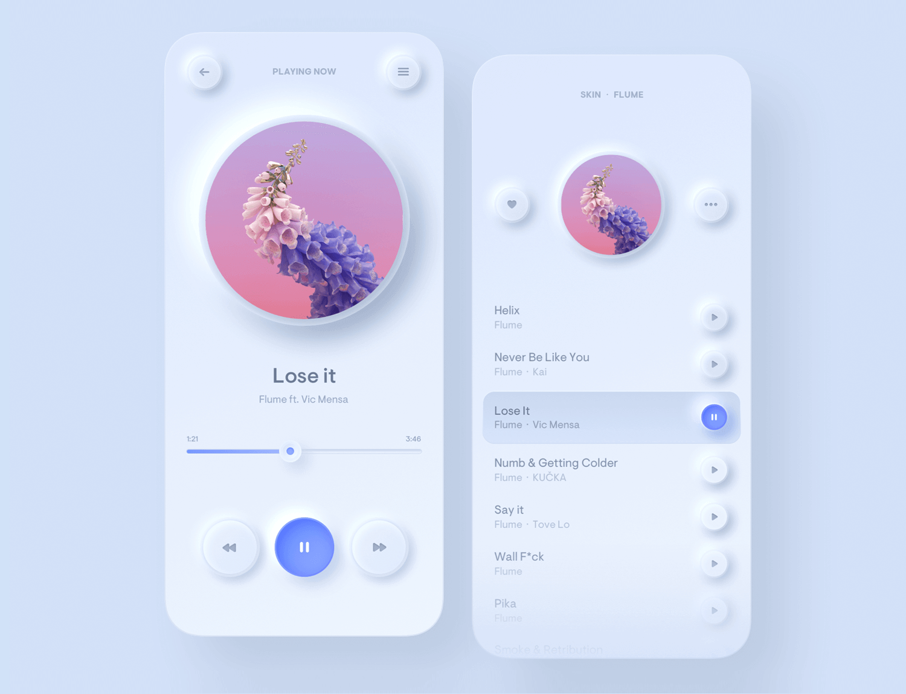
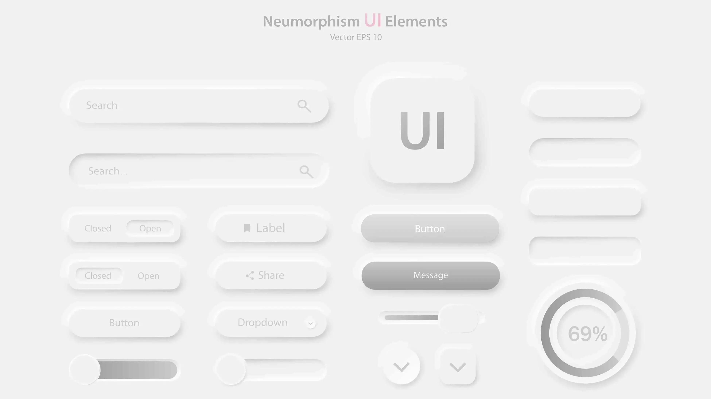

# Neumorphism (Soft UI) - Sistema de Diseño

> *"Elementos que parecen extruidos del fondo, como plástico suave moldeado."*

## Referencia Visual





---

## Qué es Neumorphism

**Neumorphism** (New + Skeuomorphism) es un estilo de diseño que combina minimalismo con sombras suaves para crear elementos que parecen:
- **Extruidos** del fondo (raised/convex)
- **Hundidos** en el fondo (pressed/inset)

### Características Clave

| Característica | Descripción |
|----------------|-------------|
| Sombras duales | Una sombra oscura + una sombra clara |
| Mismo fondo | El elemento tiene el MISMO color que el fondo |
| Bordes redondeados | Esquinas suaves, nunca cuadradas |
| Sin bordes visibles | O muy sutiles |
| Efecto 3D suave | Como plástico moldeado |

### Diferencia con Glassmorphism

| Neumorphism | Glassmorphism |
|-------------|---------------|
| Sombras externas/internas | Blur del fondo |
| Mismo color que fondo | Transparente |
| Efecto "extruido" | Efecto "vidrio flotante" |
| Sin transparencia | Con transparencia |

---

## La Técnica Core: Dual Box-Shadow

El secreto de neumorphism son **dos sombras opuestas**:

```css
/* CSS Vanilla */
box-shadow:
  [offset-x] [offset-y] [blur] [color-oscuro],  /* Sombra oscura */
  [-offset-x] [-offset-y] [blur] [color-claro]; /* Sombra clara */
```

### Ejemplo Básico

```css
/* Elemento elevado (raised) */
.neumorphic {
  background: #e6e7ee;
  box-shadow:
    6px 6px 12px #b8b9be,    /* Sombra oscura abajo-derecha */
    -6px -6px 12px #ffffff;  /* Sombra clara arriba-izquierda */
}

/* Elemento hundido (inset/pressed) */
.neumorphic-inset {
  background: #e6e7ee;
  box-shadow:
    inset 4px 4px 8px #b8b9be,
    inset -4px -4px 8px #ffffff;
}
```

---

## Paleta de Colores Recomendada

### Fondo Base (El más importante)

El fondo debe ser un **gris medio** - ni muy claro ni muy oscuro:

```html
<!-- Tailwind -->
<body class="bg-[#e6e7ee]">  <!-- Gris azulado - MÁS COMÚN -->
<body class="bg-[#f0f0f3]">  <!-- Gris claro -->
<body class="bg-[#dde1e7]">  <!-- Gris medio -->
<body class="bg-gray-200">   <!-- Alternativa Tailwind -->
```

### Cálculo de Sombras

Para cualquier color de fondo, las sombras se calculan así:

| Tipo | Fórmula | Ejemplo para #e6e7ee |
|------|---------|---------------------|
| Sombra oscura | Fondo - 15-20% brillo | `#b8b9be` |
| Sombra clara | Fondo + 15-20% brillo (o #fff) | `#ffffff` |

### Paletas Predefinidas

```css
/* Gris Clásico */
--bg: #e6e7ee;
--shadow-dark: #b8b9be;
--shadow-light: #ffffff;

/* Gris Cálido */
--bg: #e0e5ec;
--shadow-dark: #a3b1c6;
--shadow-light: #ffffff;

/* Gris Frío */
--bg: #f2f3f9;
--shadow-dark: #c8c9cf;
--shadow-light: #ffffff;

/* Azul Suave */
--bg: #e3edf7;
--shadow-dark: #a3b1c6;
--shadow-light: #ffffff;
```

---

## Implementación con Tailwind CSS

### Opción 1: Arbitrary Values (Sin Plugin)

```html
<!-- Elemento Raised -->
<div class="
  bg-[#e6e7ee]
  rounded-2xl
  shadow-[6px_6px_12px_#b8b9be,-6px_-6px_12px_#ffffff]
  p-6
">
  Contenido
</div>

<!-- Elemento Inset (Pressed) -->
<div class="
  bg-[#e6e7ee]
  rounded-2xl
  shadow-[inset_4px_4px_8px_#b8b9be,inset_-4px_-4px_8px_#ffffff]
  p-6
">
  Contenido hundido
</div>
```

### Opción 2: Extender tailwind.config.ts

```typescript
// tailwind.config.ts
export default {
  theme: {
    extend: {
      colors: {
        'neu': {
          bg: '#e6e7ee',
          dark: '#b8b9be',
          light: '#ffffff',
        }
      },
      boxShadow: {
        // Raised (elevado)
        'neu-sm': '3px 3px 6px #b8b9be, -3px -3px 6px #ffffff',
        'neu': '6px 6px 12px #b8b9be, -6px -6px 12px #ffffff',
        'neu-md': '8px 8px 16px #b8b9be, -8px -8px 16px #ffffff',
        'neu-lg': '12px 12px 24px #b8b9be, -12px -12px 24px #ffffff',
        'neu-xl': '20px 20px 40px #b8b9be, -20px -20px 40px #ffffff',

        // Inset (hundido)
        'neu-inset-sm': 'inset 2px 2px 4px #b8b9be, inset -2px -2px 4px #ffffff',
        'neu-inset': 'inset 4px 4px 8px #b8b9be, inset -4px -4px 8px #ffffff',
        'neu-inset-md': 'inset 6px 6px 12px #b8b9be, inset -6px -6px 12px #ffffff',
      },
    },
  },
}
```

```html
<!-- Uso con config extendido -->
<div class="bg-neu-bg rounded-2xl shadow-neu p-6">Raised</div>
<div class="bg-neu-bg rounded-2xl shadow-neu-inset p-6">Inset</div>
```

### Opción 3: Plugin tailwindcss-neumorphism

```bash
npm install tw-neumorphism
```

```javascript
// tailwind.config.js
module.exports = {
  plugins: [require('tw-neumorphism')],
}
```

**Clases generadas:**

| Clase | Efecto |
|-------|--------|
| `nm-flat-gray-200` | Plano con sombras |
| `nm-concave-gray-200` | Cóncavo (hundido con gradiente) |
| `nm-convex-gray-200` | Convexo (elevado con gradiente) |
| `nm-inset-gray-200` | Inset (presionado) |

**Tamaños disponibles:**
- `nm-flat-gray-200-xs` (0.05em)
- `nm-flat-gray-200-sm` (0.1em)
- `nm-flat-gray-200` (0.2em - default)
- `nm-flat-gray-200-lg` (0.4em)
- `nm-flat-gray-200-xl` (0.8em)

---

## Recetas Listas para Usar

### Card Neumorphic

```html
<div class="
  bg-[#e6e7ee]
  rounded-3xl
  shadow-[8px_8px_16px_#b8b9be,-8px_-8px_16px_#ffffff]
  p-8
">
  <h3 class="text-gray-700 font-semibold text-xl">Card Title</h3>
  <p class="text-gray-500 mt-2">Card content goes here...</p>
</div>
```

### Botón Neumorphic (con hover)

```html
<button class="
  bg-[#e6e7ee]
  rounded-xl
  shadow-[6px_6px_12px_#b8b9be,-6px_-6px_12px_#ffffff]
  hover:shadow-[inset_4px_4px_8px_#b8b9be,inset_-4px_-4px_8px_#ffffff]
  active:shadow-[inset_4px_4px_8px_#b8b9be,inset_-4px_-4px_8px_#ffffff]
  px-8 py-4
  text-gray-600 font-medium
  transition-shadow duration-200
">
  Click Me
</button>
```

### Botón con Icono

```html
<button class="
  bg-[#e6e7ee]
  rounded-full
  shadow-[6px_6px_12px_#b8b9be,-6px_-6px_12px_#ffffff]
  hover:shadow-[inset_3px_3px_6px_#b8b9be,inset_-3px_-3px_6px_#ffffff]
  w-14 h-14
  flex items-center justify-center
  text-gray-600
  transition-shadow duration-200
">
  <svg class="w-6 h-6" fill="currentColor" viewBox="0 0 20 20">
    <!-- Icon SVG -->
  </svg>
</button>
```

### Input Neumorphic

```html
<input
  type="text"
  placeholder="Enter your email"
  class="
    w-full
    bg-[#e6e7ee]
    rounded-xl
    shadow-[inset_4px_4px_8px_#b8b9be,inset_-4px_-4px_8px_#ffffff]
    px-6 py-4
    text-gray-700
    placeholder-gray-400
    outline-none
    focus:shadow-[inset_6px_6px_12px_#b8b9be,inset_-6px_-6px_12px_#ffffff]
    transition-shadow duration-200
  "
/>
```

### Toggle Switch

```html
<div class="
  relative
  w-16 h-8
  bg-[#e6e7ee]
  rounded-full
  shadow-[inset_4px_4px_8px_#b8b9be,inset_-4px_-4px_8px_#ffffff]
  cursor-pointer
">
  <!-- Knob -->
  <div class="
    absolute top-1 left-1
    w-6 h-6
    bg-[#e6e7ee]
    rounded-full
    shadow-[3px_3px_6px_#b8b9be,-3px_-3px_6px_#ffffff]
    transition-transform duration-300
    peer-checked:translate-x-8
  "></div>
</div>
```

### Progress Bar

```html
<div class="
  w-full h-4
  bg-[#e6e7ee]
  rounded-full
  shadow-[inset_2px_2px_4px_#b8b9be,inset_-2px_-2px_4px_#ffffff]
  overflow-hidden
">
  <div class="
    h-full w-3/4
    bg-gradient-to-r from-blue-400 to-blue-500
    rounded-full
    shadow-[2px_0_4px_rgba(0,0,0,0.1)]
  "></div>
</div>
```

### Navbar Neumorphic

```html
<nav class="
  bg-[#e6e7ee]
  shadow-[0_4px_12px_#b8b9be]
  px-8 py-4
">
  <div class="max-w-6xl mx-auto flex items-center justify-between">
    <span class="text-gray-700 font-bold text-xl">Logo</span>

    <div class="flex items-center gap-6">
      <a href="#" class="text-gray-600 hover:text-gray-800">Home</a>
      <a href="#" class="text-gray-600 hover:text-gray-800">About</a>

      <button class="
        bg-[#e6e7ee]
        rounded-xl
        shadow-[4px_4px_8px_#b8b9be,-4px_-4px_8px_#ffffff]
        hover:shadow-[inset_2px_2px_4px_#b8b9be,inset_-2px_-2px_4px_#ffffff]
        px-6 py-2
        text-gray-600 font-medium
        transition-shadow duration-200
      ">
        Sign In
      </button>
    </div>
  </div>
</nav>
```

### Sidebar Item

```html
<a href="#" class="
  flex items-center gap-4
  bg-[#e6e7ee]
  rounded-xl
  shadow-[4px_4px_8px_#b8b9be,-4px_-4px_8px_#ffffff]
  hover:shadow-[inset_3px_3px_6px_#b8b9be,inset_-3px_-3px_6px_#ffffff]
  px-6 py-4
  text-gray-600
  transition-shadow duration-200
">
  <span class="w-5 h-5"><!-- Icon --></span>
  <span>Dashboard</span>
</a>
```

### Stat Card

```html
<div class="
  bg-[#e6e7ee]
  rounded-2xl
  shadow-[8px_8px_16px_#b8b9be,-8px_-8px_16px_#ffffff]
  p-6
">
  <div class="
    w-12 h-12
    bg-[#e6e7ee]
    rounded-xl
    shadow-[inset_3px_3px_6px_#b8b9be,inset_-3px_-3px_6px_#ffffff]
    flex items-center justify-center
    text-blue-500
    mb-4
  ">
    <svg class="w-6 h-6" fill="currentColor"><!-- Icon --></svg>
  </div>

  <p class="text-gray-500 text-sm">Total Users</p>
  <p class="text-gray-700 text-3xl font-bold">12,543</p>
</div>
```

---

## Variantes de Estilo

### Flat (Plano)

```html
<div class="
  bg-[#e6e7ee]
  rounded-2xl
  shadow-[6px_6px_12px_#b8b9be,-6px_-6px_12px_#ffffff]
">
  Flat - Fondo sólido con sombras
</div>
```

### Convex (Abombado hacia afuera)

```html
<div class="
  bg-gradient-to-br from-[#f0f1f5] to-[#dcdde3]
  rounded-2xl
  shadow-[6px_6px_12px_#b8b9be,-6px_-6px_12px_#ffffff]
">
  Convex - Gradiente que simula curvatura hacia afuera
</div>
```

### Concave (Abombado hacia adentro)

```html
<div class="
  bg-gradient-to-br from-[#dcdde3] to-[#f0f1f5]
  rounded-2xl
  shadow-[6px_6px_12px_#b8b9be,-6px_-6px_12px_#ffffff]
">
  Concave - Gradiente que simula curvatura hacia adentro
</div>
```

### Inset (Presionado)

```html
<div class="
  bg-[#e6e7ee]
  rounded-2xl
  shadow-[inset_4px_4px_8px_#b8b9be,inset_-4px_-4px_8px_#ffffff]
">
  Inset - Sombras internas, como si estuviera hundido
</div>
```

---

## Dark Mode

Neumorphism también funciona en modo oscuro:

```html
<body class="bg-[#2d2d2d]">
  <div class="
    bg-[#2d2d2d]
    rounded-2xl
    shadow-[6px_6px_12px_#1a1a1a,-6px_-6px_12px_#404040]
    p-8
  ">
    Dark Neumorphism
  </div>
</body>
```

### Paleta Dark Mode

```css
/* Dark Mode */
--bg: #2d2d2d;
--shadow-dark: #1a1a1a;
--shadow-light: #404040;

/* Dark Blue */
--bg: #1e3a5f;
--shadow-dark: #142942;
--shadow-light: #284b7c;
```

---

## Accesibilidad - IMPORTANTE

### Problemas Conocidos

1. **Bajo contraste**: Las sombras suaves no cumplen WCAG
2. **Jerarquía confusa**: Todo se ve igual
3. **Estados poco claros**: Difícil distinguir hover/focus/disabled

### Recomendaciones

```html
<!-- Añadir indicadores de color para estados -->
<button class="
  bg-[#e6e7ee]
  shadow-[6px_6px_12px_#b8b9be,-6px_-6px_12px_#ffffff]

  /* Focus visible con ring */
  focus:ring-2 focus:ring-blue-500 focus:ring-offset-2

  /* Disabled con opacidad */
  disabled:opacity-50 disabled:cursor-not-allowed
">
```

### Cuándo Usar y Cuándo NO

| ✅ Usar Para | ❌ Evitar Para |
|-------------|---------------|
| Cards decorativas | CTAs principales |
| Contenedores estáticos | Formularios críticos |
| Elementos de dashboard | Validación (error/success) |
| Navegación secundaria | Botones de acción primaria |

---

## Mejores Prácticas

### DO (Hacer)

1. **Mantener el mismo color de fondo** - Elemento = Fondo del padre
2. **Usar bordes redondeados** - Mínimo `rounded-xl`
3. **Sombras proporcionales** - Más grandes para elementos más grandes
4. **Transiciones suaves** - `transition-shadow duration-200`
5. **Combinar con colores de acento** - Para iconos y texto importante
6. **Usar para UI secundaria** - No para acciones críticas

### DON'T (No Hacer)

1. **No usar en fondos con patrón** - Requiere fondo sólido uniforme
2. **No exceder con sombras** - Mantener sutileza
3. **No usar para botones primarios** - Bajo contraste = baja conversión
4. **No ignorar accesibilidad** - Añadir focus rings
5. **No usar en fondos muy claros o muy oscuros** - Gris medio es ideal

---

## Tamaños de Sombra Recomendados

| Tamaño | Sombra | Uso |
|--------|--------|-----|
| XS | `3px 3px 6px, -3px -3px 6px` | Iconos, badges pequeños |
| SM | `4px 4px 8px, -4px -4px 8px` | Botones pequeños |
| MD | `6px 6px 12px, -6px -6px 12px` | Botones, inputs |
| LG | `8px 8px 16px, -8px -8px 16px` | Cards |
| XL | `12px 12px 24px, -12px -12px 24px` | Modals, paneles grandes |
| 2XL | `20px 20px 40px, -20px -20px 40px` | Hero sections |

---

## Referencias

- [CSS-Tricks - Neumorphism and CSS](https://css-tricks.com/neumorphism-and-css/)
- [DEV.to - Responsive Neumorphic UI with TailwindCSS](https://dev.to/mbianoubradon/how-to-create-a-responsive-neumorphic-ui-using-tailwindcss-47c7)
- [Neumorphism.io - CSS Generator](https://neumorphism.io/)
- [GitHub - tailwindcss-neumorphism Plugin](https://github.com/sambeevors/tailwindcss-neumorphism)
- [Themesberg - Neomorphic Elements Tutorial](https://themesberg.com/blog/tutorial/neomorphic-elements-css-html-tutorial)

---

*Este documento es parte del Design System de SaaS Factory V2.*
